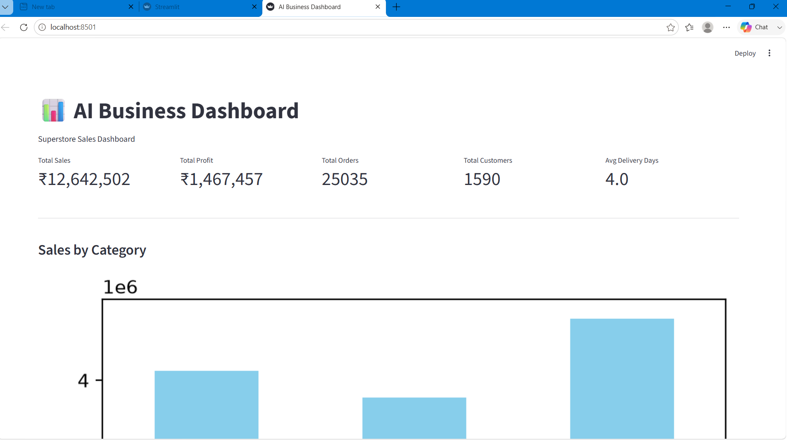
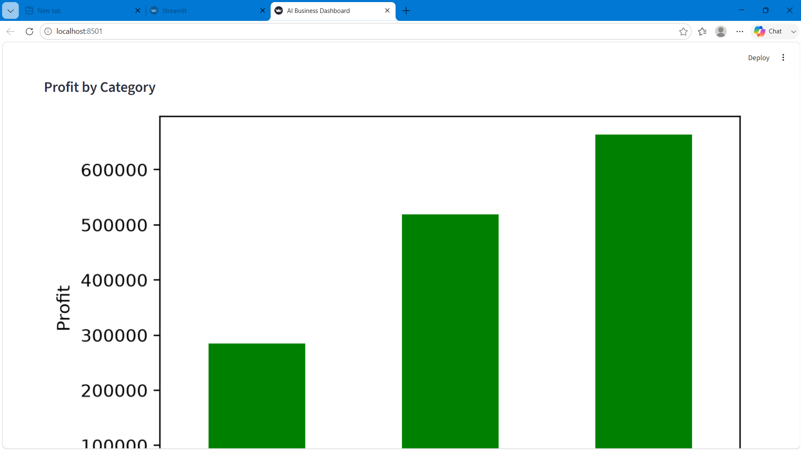
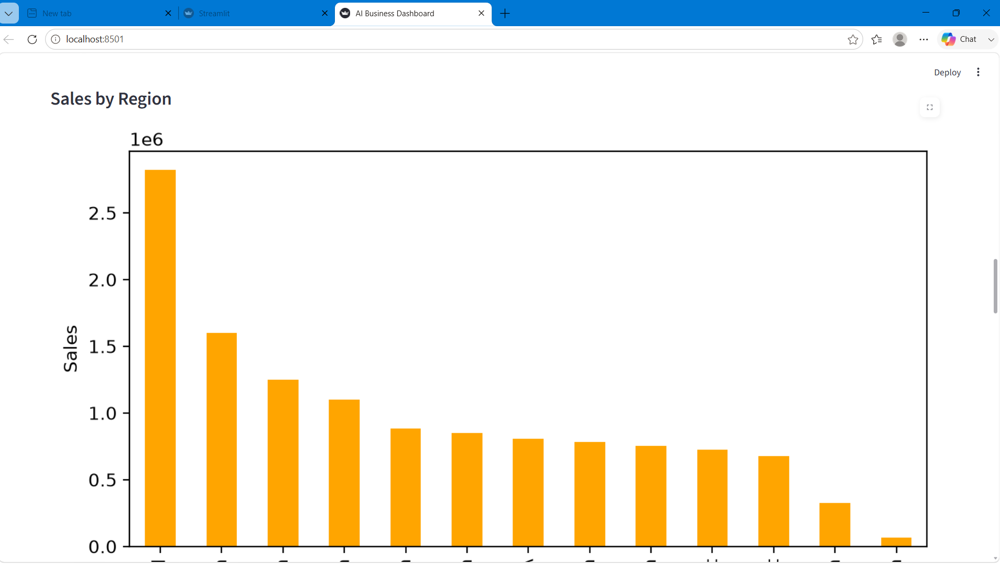
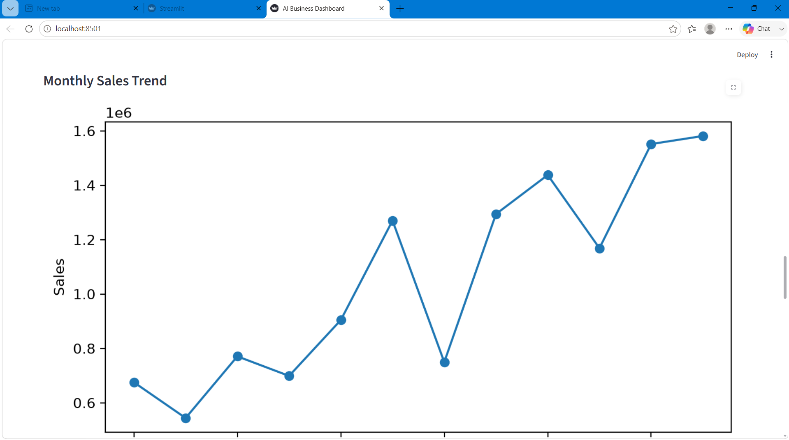
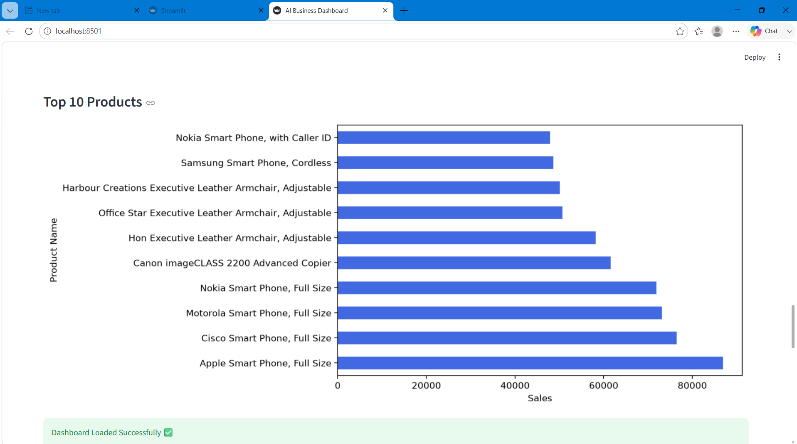
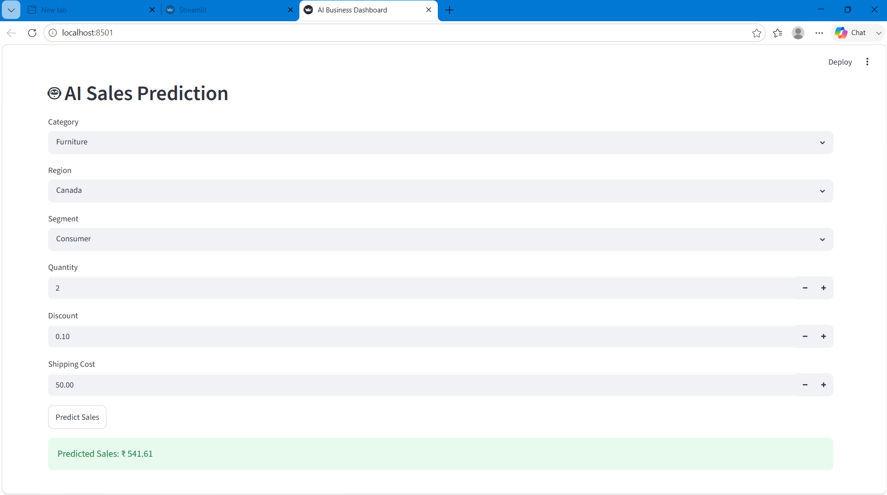

# 📊 AI Business Dashboard

## Overview

The **AI Business Dashboard** is an interactive web application built using **Python** and **Streamlit**. It analyzes Superstore sales data, provides interactive visualizations, predicts future sales using a Machine Learning model, and helps users gain business insights through an intuitive dashboard.

---

# ✨ Features

* 📈 Interactive Business Dashboard
* 📊 Sales, Profit & Quantity Analysis
* 🗂️ Region, Category & Segment Filters
* 📅 Monthly & Yearly Sales Trends
* 🤖 Machine Learning Based Sales Prediction
* 📉 Data Visualization
* ⚡ Fast and User-Friendly Interface

---

# 🏗️ System Architecture

```text
                +----------------------+
                |  Superstore Dataset  |
                | (CSV / Excel Files)  |
                +----------+-----------+
                           |
                           v
                +----------------------+
                | Data Preprocessing   |
                | (Pandas, NumPy)      |
                +----------+-----------+
                           |
                           v
                +----------------------+
                | Machine Learning     |
                | Trained Model (.pkl) |
                +----------+-----------+
                           |
                           v
                +----------------------+
                | Streamlit Dashboard  |
                | Interactive UI       |
                +----------+-----------+
                           |
                           v
                +----------------------+
                | Business Insights &  |
                | Sales Prediction     |
                +----------------------+
```

---

# 🔄 Workflow

Dataset
   │
   ▼
Data Cleaning & Preprocessing
   │
   ▼
Feature Engineering
   │
   ▼
Machine Learning Model
   │
   ▼
Prediction
   │
   ▼
Interactive Dashboard
   │
   ▼
Business Insights
```


# 📂 Project Structure


AI-Business-Dashboard/
│
├── app.py
├── eda.ipynb
├── ml.ipynb
├── cleaned_superstore.csv
├── Global_Superstore2.xlsx
├── sales_prediction_model.pkl
├── encoders.pkl
├── requirements.txt
├── README.md
└── screenshots/
    ├── dashboard.png
    └── prediction.png

---

# 🛠️ Technology Stack

| Component            | Technology                |
| -------------------- | ------------------------- |
| Programming Language | Python                    |
| Frontend             | Streamlit                 |
| Data Processing      | Pandas, NumPy             |
| Data Visualization   | Matplotlib                |
| Machine Learning     | Scikit-learn              |
| Model Storage        | Pickle (.pkl)             |
| Dataset              | Global Superstore         |
| Deployment           | Streamlit Community Cloud |
| Version Control      | Git & GitHub              |

---

# 🚀 Installation

Clone the repository

```bash
git clone https://github.com/your-username/AI-Business-Dashboard.git
```

Go to the project folder

```bash
cd AI-Business-Dashboard
```

Install dependencies

```bash
pip install -r requirements.txt
```

Run the application

```bash
streamlit run app.py
```

---

# 🌐 Live Demo

**Streamlit App**

https://your-streamlit-app.streamlit.app

---

# 📸 Screenshots

### Dashboard








### Prediction



---

# 📊 Machine Learning Pipeline

* Data Collection
* Data Cleaning
* Feature Encoding
* Model Training
* Model Evaluation
* Model Serialization (.pkl)
* Deployment with Streamlit

---

# 📈 Future Improvements

* Real-time Dashboard
* Deep Learning Sales Forecasting
* Customer Segmentation
* Automated Report Generation
* Cloud Database Integration
* User Authentication
* Advanced KPI Dashboard

---

# 👨‍💻 Author

**Shakeel Irfan**

GitHub: https://github.com/shakeelirfan1

---

# 📄 License

This project is created for educational and portfolio purposes.
